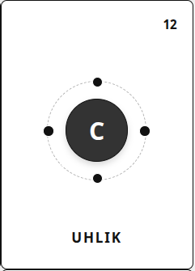
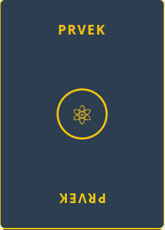
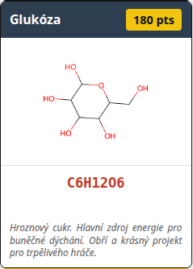

# Molekuly - pravidla hry

- [Molekuly - pravidla hry](#molekuly---pravidla-hry)
  - [Přehled komponentů](#přehled-komponentů)
    - [1. Karty atomů (Suroviny)](#1-karty-atomů-suroviny)
    - [2. Karty receptů (Úkoly)](#2-karty-receptů-úkoly)
  - [Příprava hry (setup)](#příprava-hry-setup)
  - [Průběh herního kola](#průběh-herního-kola)
    - [Možnost A: Chemická reakce (Akce na stole)](#možnost-a-chemická-reakce-akce-na-stole)
    - [Možnost B: Lízání karet](#možnost-b-lízání-karet)
  - [Zákon stability (klíčové pravidlo tahu)](#zákon-stability-klíčové-pravidlo-tahu)
  - [Plnění receptů a bodování](#plnění-receptů-a-bodování)
  - [Konec hry a vyhodnocení](#konec-hry-a-vyhodnocení)

## Přehled komponentů

### 1. Karty atomů (Suroviny)

* Každá karta představuje jeden chemický prvek.
* **Grafika:** Používá mezinárodní barevné kódování (H = bílá, C = černá, O = červená, N = modrá, Cl = zelená).
* **Valenční vazby:** Na okrajích karty jsou jasně vyznačené tečky/sloty představující valenční elektrony (vazby).
* **Hodnota:** V rohu karty je uvedeno číslo odpovídající přibližné atomové hmotnosti prvku (H=1, C=12, N=14, O=16, Na=23, Cl=35). Toto číslo slouží jako cena karty na ruce na konci hry.

### 2. Karty receptů (Úkoly)

* **Obsah:** Reálné sloučeniny z běžného života (kuchyňská sůl, ocet, mýdlo/glycerol, ethanol, ale i chlorový plyn či nitroglycerin).
* **Vzorec a schéma:** Karta obsahuje chemický vzorec a nákres, jak přesně musí karty na stole ležet, aby byla molekula správně poskládaná.
* **Zajímavost:** Krátký text vysvětlující, k čemu látka slouží a jak se chová.
* **Bodová hodnota:** Součet hmotností všech atomů v molekule + případný bonus za náročnost.

## Příprava hry (setup)

1. **Balíček atomů:** Zamíchá se a každému hráči se rozdá startovní ruka (např. 7 karet). Zbytek tvoří lízací balíček.
2. **Veřejná laboratoř (Nabídka receptů):** Uprostřed stolu se vyloží karty receptů v počtu **[Počet hráčů × 2]**. Pokud hrají 4 hráči, na stole leží 8 otevřených receptů, na které vidí všichni.
3. **Společný stůl:** Prostor uprostřed stolu slouží jako společné reakční pole. Na začátku hry je prázdný.

## Průběh herního kola

Hráč může ve svém tahu rozebrat jakoukoliv molekulu nebo strukturu, která už na stole leží. Může z ní vytrhnout jednotlivé atomy, odpojit celé funkční skupiny (např. methany nebo hydroxyly) a libovolně je kombinovat s kartami ze své ruky.

Platí zde ale jedno tvrdé žolíkové pravidlo: Na konci tahu hráče musí všechny karty, které zůstaly na stole, tvořit chemicky validní struktury. Pokud hráč začne stůl přerovnávat, ale v polovině se zamotá a na stole mu zůstane viset izolovaný kyslík s neukončenými vazbami, jeho tah je nevalidní. Musí buď situaci vyřešit kartami z ruky, nebo vrátit stůl do původního stavu a za trest si líznout kartu z balíčku.

Hráči se střídají po směru hodinových ručiček. Ve svém tahu má hráč dvě možnosti:

### Možnost A: Chemická reakce (Akce na stole)

Hráč vyloží z ruky libovolný počet karet atomů a pokusí se provést změny na stole. Na stole může udělat **„cokoliv“** za předpokladu, že dodrží **Zákon stability** (viz níže).

* Může začít stavět úplně novou molekulu.
* Může přiložit atomy k již rozestavěným strukturám na stole.
* Může kompletně rozebrat jakékoliv molekuly, které na stole už leží, vzít si z nich atomy a přeskládat je do úplně jiných sloučenin (přidat k nim karty z ruky).

### Možnost B: Lízání karet

Pokud hráč nemůže nebo nechce vyložit žádnou kartu z ruky ani pohnout stolem, musí si líznout **1 kartu atomu** z lízacího balíčku. Tím jeho tah končí.

## Zákon stability (klíčové pravidlo tahu)

Jakákoliv manipulace s kartami na stole podléhá přísnému pravidlu: **Na konci tahu hráče musí být všechny molekuly na stole kompletní a chemicky stabilní.**

Hráč může během tahu brát karty atomů ze stolu zpátky do roku, ale musí za tah vyložit více karte na stůl, než si jich bere. 

* To znamená, že na stole nesmí zůstat žádná karta, která by měla volnou (nepropojenou) valenční vazbu. Každá tečka/vazba musí být spárovaná s jiným atomem.
* Pokud hráč stůl rozebere a nedokáže ho do konce svého tahu kompletně pospojovat do stabilních látek, jeho tah je neplatný. Musí vrátit stůl do původního stavu, vzít si své karty zpět na ruku a jako penalizaci si líznout kartu z balíčku.

## Plnění receptů a bodování

1. Pokud se hráči během jeho tahu podaří na stole úspěšně sestavit (nebo transformovat) molekulu, která přesně odpovídá jednomu z otevřených **Receptů** v nabídce, hráč tuto kartu receptu okamžitě získává pro sebe.
2. Do veřejné nabídky se ihned doplní nová karta receptu z balíčku úkolů, aby byl počet karet stále [Počet hráčů × 2].
3. Pokud při plnění receptu zbyly na stole nějaké jiné atomy, hráč je musí před koncem tahu úspěšně zapojit do jiných stabilních molekul, které na stole zůstávají.

## Konec hry a vyhodnocení

* **Konec kola:** Kolo končí v momentě, kdy jeden z hráčů **zavře**, tedy úspěšně vyloží svou poslední kartu z ruky na stůl a stůl zůstane stabilní.
* **Penalizace za neuklizenou ruku:** Ostatní hráči si spočítají hodnotu karet atomů, které jim zůstaly na ruce. Každý atom se započítá podle své reálné hmotnosti (Vodík = 1 bod, ale Chlór = 35 bodů!).
* **Výpočet skóre:** Výsledné skóre hráče za dané kolo se spočítá jako:
`[Body za získané karty receptů] − [Součet hmotností atomů, které mu zůstaly na ruce]`.
* **Vítězství:** Vyhrává hráč s nejvyšším počtem bodů.